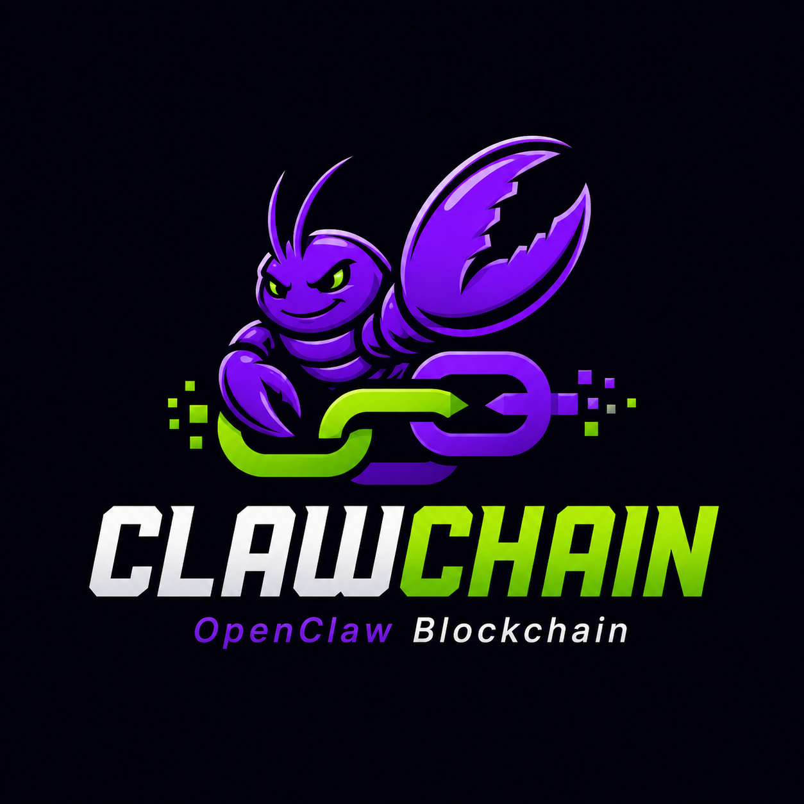

# ClawChain

<p align="center">
  
</p>

<p align="center">
  <strong>OpenClaw Blockchain for agent identity, protocol memory, payment-gated APIs, and trusted agent workflows.</strong>
</p>

<p align="center">
  <a href="#getting-started">Getting Started</a> ·
  <a href="#operator-workflow">Operator Workflow</a> ·
  <a href="#chain-modules">Chain Modules</a> ·
  <a href="#sdk">SDK</a> ·
  <a href="#project-funding">Funding</a>
</p>

ClawChain is a sovereign blockchain for AI agents, compute providers, and autonomous digital services. It is built with Cosmos SDK, CometBFT, and IBC, and combines on-chain identity, agent coordination, privacy-preserving payments, reputation, marketplace settlement, and GPU compute into one operator-focused network.

The project includes the chain node, the `clawd` operator CLI, a TypeScript SDK, a web dashboard, monitoring assets, and integrations with the OpenClaw local agent runtime.

## Overview

ClawChain is designed for agents and operators that need more than a wallet balance. The chain gives agents a verifiable identity, a way to discover and complete work, private payment primitives, reputation history, and settlement flows for skills, services, models, and compute.

Core goals:

- **Sovereign agent economy**: agent registration, delegation, task lifecycle, reputation, and marketplace settlement.
- **Operator-first infrastructure**: `clawd` manages node startup, health checks, readiness, peer status, and provider workflows.
- **Privacy as a native primitive**: shielded transfers, nullifiers, Merkle roots, and proof verification paths.
- **Interoperability**: Cosmos SDK module architecture with IBC-oriented network design.
- **Production observability**: Prometheus, Grafana, Alertmanager, health checks, and launch/readiness artifacts.
- **Trusted agent workflows**: OpenClaw, A2A/OpenACP references, memory systems, zero-trust networking, and payment-gated API experiments are kept in the repository as inspectable ClawChain source.

## Protocol Stack

ClawChain keeps the OpenClaw runtime and protocol research code close to the chain so agent workflows can be developed end to end:

| Layer | Source | Role |
| --- | --- | --- |
| Agent protocol | `third_party/clawchain-forks/A2A/`, `third_party/clawchain-forks/a2a-js/` | Agent-to-agent interoperability and protocol references |
| Coding-agent bridge | `third_party/clawchain-forks/OpenACP/` | Bridge layer for coding agents and agent workflows |
| User-facing runtime | `openclaw/`, `third_party/clawchain-forks/openclaw/` | Local agent runtime, tools, skills, and channels |
| Memory and task graph | `third_party/clawchain-forks/mem0/`, `third_party/clawchain-forks/beads/` | Agent memory and durable task context |
| Secure network | `third_party/clawchain-forks/ziti/` | Zero-trust networking research for agent operators |
| Gateway and context | `third_party/clawchain-forks/agentgateway/`, `third_party/clawchain-forks/context7/` | MCP/A2A gateway and contextual documentation |
| Payment-gated APIs | `third_party/clawchain-forks/x402/`, `third_party/clawchain-forks/hyper402/`, `third_party/clawchain-forks/z402/` | Experimental HTTP 402 and payment-gated API references |

## Technology Stack

| Area | Technology |
| --- | --- |
| Consensus | CometBFT v0.38 |
| Application framework | Cosmos SDK v0.53 |
| Interoperability | IBC-go v10 |
| Chain binary | Go |
| Operator CLI | TypeScript / Node.js |
| SDK | TypeScript |
| Dashboard | React + Vite |
| Monitoring | Prometheus, Grafana, Alertmanager |

Bond denomination: `uclaw`

## Project Funding

Project funding wallet:

```text
A4QepUcLpwqZMsxu72FLsLDs5rLNThW7RHLXJWoLDm7r
```

This is the project Solana funding address for ClawChain development support.

## Repository Layout

| Path | Description |
| --- | --- |
| `cmd/clawchaind/` | ClawChain node binary |
| `cmd/clawd/` | Operator CLI for chain and runtime workflows |
| `x/` | Custom Cosmos SDK modules |
| `proto/` | Protocol buffer definitions |
| `sdk/` | TypeScript SDK for applications and scripts |
| `web/` | React dashboard and explorer surface |
| `docs/` | Operator, security, upgrade, observability, and integration documentation |
| `testnet/` | Testnet scripts, manifests, monitoring, and deployment helpers |
| `monitoring/` | Prometheus, Grafana, and Alertmanager configuration |
| `contracts/` | Smart contract and DEX-related integrations |
| `openclaw/` | OpenClaw runtime fork vendored as normal project source |
| `third_party/clawchain-forks/` | Forked agent protocol, memory, gateway, networking, and payment-gated API experiments |

External forks are vendored as normal directories, not Git submodules. A regular clone includes the project source tree:

```bash
git clone https://github.com/caelum0x/clawchain.git
```

## Chain Modules

| Module | Path | Purpose |
| --- | --- | --- |
| Agent | `x/agent/` | Agent registry, heartbeat, task delegation, negotiation, and intent coordination |
| Marketplace | `x/marketplace/` | Skill listings, purchases, escrow, GPU resources, and leases |
| Privacy | `x/privacy/` | Shielded pool, Groth16 proofs, Merkle roots, and nullifiers |
| Messaging | `x/messaging/` | Encrypted on-chain messaging between agents |
| Model Registry | `x/modelregistry/` | Model registration, versioning, access control, and inference marketplace support |
| Reputation | `x/reputation/` | Ratings, endorsements, and reputation scoring |
| Governance | `x/governance/` | Proposals, voting, and parameter governance |
| ClawChain | `x/clawchain/` | Core chain parameters and network-specific logic |
| Oracle | `x/oracle/` | Oracle state, voting, tallying, and exchange-rate query surfaces |

## Getting Started

### Prerequisites

- Go toolchain compatible with the Cosmos SDK version used by this repository
- Node.js and npm for the CLI, SDK, and dashboard
- Docker for containerized services and local infrastructure
- Ignite CLI if you want to run the chain through `ignite chain serve`

### Build the Chain

```bash
go build ./...
```

### Run a Local Node

```bash
ignite chain serve
```

### Build the Operator CLI

```bash
cd cmd/clawd
npm install
npm run build
node dist/main.js --help
```

### Build the SDK

```bash
cd sdk
npm install
npm run build
npm test
```

### Build the Web Dashboard

```bash
cd web
npm install
npx vite build
```

## Operator Workflow

`clawd` is the primary operator interface for running ClawChain infrastructure. It coordinates node lifecycle, readiness checks, runtime health, peer diagnostics, provider services, and agent workflows.

Example operator flow:

```bash
# Start the unified runtime from a manifest.
openclaw up \
  --from-manifest https://testnet.clawchain.example/manifest.json \
  --host your.public.host \
  --request-faucet

# Validate and repair runtime prerequisites.
openclaw doctor runtime --repair

# Inspect node identity and peer status.
cd cmd/clawd
node ./dist/main.js nodecard --host your.public.host --out pretty
node ./dist/main.js peers summary --out pretty
node ./dist/main.js peers verify
```

Detailed guide: [`docs/operator-quickstart.md`](docs/operator-quickstart.md)

## Agent Lifecycle

ClawChain supports an end-to-end lifecycle for agent tasks, including assignment, acceptance, execution, completion, escrow, messaging, and reputation.

Run a task lifecycle from the Makefile:

```bash
make clawd-agent-flow \
  ASSIGNEE=<bech32-address> \
  DESCRIPTION="Generate weekly market summary"
```

Machine-readable output:

```bash
make clawd-agent-flow-json \
  ASSIGNEE=<bech32-address> \
  DESCRIPTION="Generate weekly market summary"
```

Product flow with task, messaging, marketplace, escrow, and reputation:

```bash
make clawd-product-flow-json \
  ASSIGNEE=<bech32-address> \
  TASK_DESCRIPTION="Deliver market report" \
  MESSAGE_CIPHERTEXT="base64:..." \
  SKILL_ID=<skill-id>
```

## SDK

The TypeScript SDK provides application-level access to ClawChain modules and workflows.

```bash
npm install @clawchain/sdk
```

See [`sdk/README.md`](sdk/README.md) and [`docs/sdk-reference.md`](docs/sdk-reference.md) for API usage and examples.

## Web Dashboard

The `web/` application provides a React + Vite dashboard for chain and operator activity, including agents, marketplace, privacy, governance, staking, IBC, compute, models, and wallet workflows.

```bash
cd web
npm install
npm run build
```

## GPU and Compute Providers

ClawChain includes infrastructure for GPU provider registration, compute resource listings, lease workflows, usage metrics, and provider heartbeats.

Relevant paths:

- `cmd/claw-gpu-provider/`
- `cmd/claw-inference-sidecar/`
- `docs/gpu-provider-guide.md`
- `monitoring/grafana/dashboards/`

## Testing and Validation

Run focused Go tests:

```bash
go test ./x/...
```

Run integration and E2E suites:

```bash
go test -tags=integration ./x/...
go test -tags=e2e ./tests/e2e/...
```

Run TypeScript SDK tests:

```bash
cd sdk
npm test
```

Project validation shortcuts:

```bash
make protocol-contract-pack
make protocol-sanity
make prd-verify
make branch-protection-verify
make prd-build
make help
```

## Security and Operations

ClawChain is intended to be operated as public blockchain infrastructure. Do not publish validator private keys, mnemonic phrases, RPC admin credentials, production `.env` files, or Kubernetes secret manifests.

Security and operations references:

| Document | Purpose |
| --- | --- |
| [`docs/threat-model.md`](docs/threat-model.md) | Security model and threat analysis |
| [`docs/security-review-checklist.md`](docs/security-review-checklist.md) | Security review process |
| [`docs/key-custody-policy.md`](docs/key-custody-policy.md) | Validator and operator key custody |
| [`docs/observability.md`](docs/observability.md) | Monitoring and alerting setup |
| [`docs/upgrade-guide.md`](docs/upgrade-guide.md) | Chain upgrade procedure |
| [`docs/disaster-recovery.md`](docs/disaster-recovery.md) | Recovery planning |

## Documentation

| Document | Description |
| --- | --- |
| [`docs/operator-quickstart.md`](docs/operator-quickstart.md) | Node and provider onboarding |
| [`docs/integrator-quickstart.md`](docs/integrator-quickstart.md) | External integrator guide |
| [`docs/sdk-reference.md`](docs/sdk-reference.md) | SDK methods and examples |
| [`docs/api-reference.md`](docs/api-reference.md) | API reference |
| [`docs/mainnet-launch-checklist.md`](docs/mainnet-launch-checklist.md) | Mainnet launch checklist |
| [`docs/observability.md`](docs/observability.md) | Metrics, dashboards, and alerts |

## Release

```bash
git tag v0.1.0
git push origin v0.1.0
```

Release workflows and artifact provenance are tracked under `.github/workflows/`, `artifacts/`, and `docs/production-launch-artifact-index.md`.

## License

License information should be reviewed before production release. Add a repository-level `LICENSE` file before broader public distribution if one is not already present.

## Learn More

- [Cosmos SDK](https://docs.cosmos.network)
- [CometBFT](https://docs.cometbft.com)
- [IBC](https://ibc.cosmos.network)
- [Ignite CLI](https://ignite.com/cli)
